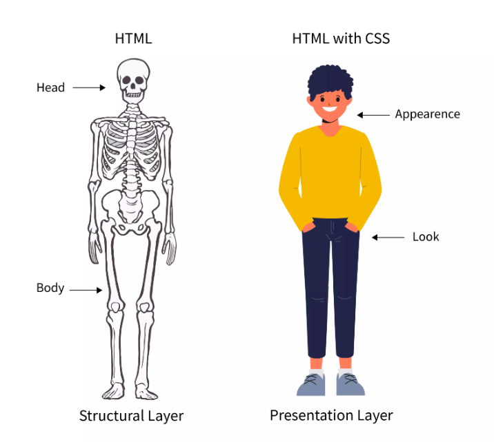

# Introduction to CSS

- Cascading Style Sheets (CSS) is a style sheet language used for describing the presentation of a document written in a markup language such as HTML or XML.

- Example
  - [Github example](https://github.com/)
