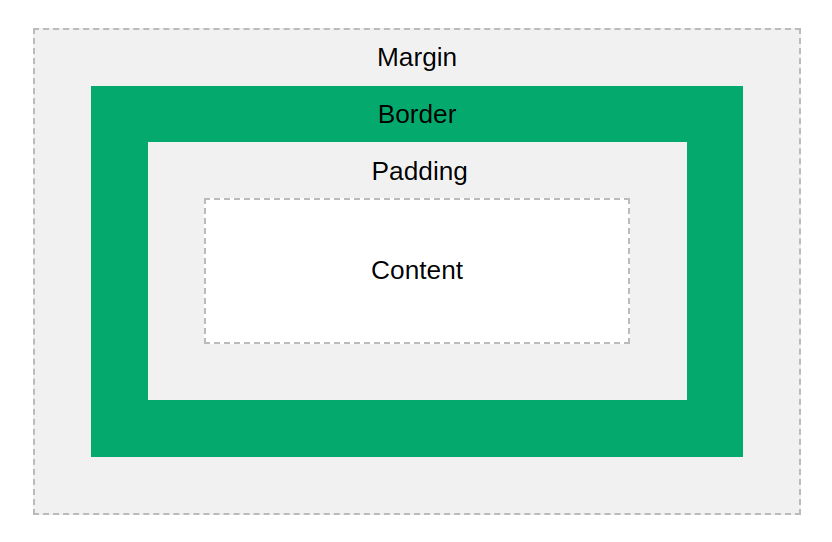
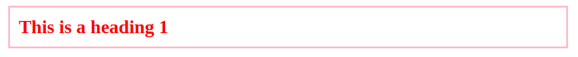

# Box Model

- Box model is essentially a box that wraps around every HTML element. It consists of: margins, borders, padding, and the actual content.



**code**

- create index.html

```html
<html>
  <head>
    <link rel="stylesheet" href="./app.css" />
  </head>
  <body>
    <h1 id="header">This is a heading 1</h1>
  </body>
</html>
```

- create app.css

```css
#header {
  color: red;
  padding: 15px;
  border-style: solid;
  border-color: pink;
  margin: 20px;
  width: 50%;
}
```

**output**


## Shorthand property

- padding: 25px 50px 75px 100px;

  - top padding is 25px
  - right padding is 50px
  - bottom padding is 75px
  - left padding is 100px

---

- padding: 25px 50px 75px;

  - top padding is 25px
  - right and left paddings are 50px
  - bottom padding is 75px

---

- padding: 25px 50px;

  - top and bottom paddings are 25px
  - right and left paddings are 50px

---

- padding: 25px;
  - all four paddings are 25px

**Note**

- margin can be given in same way using above shorthand property.
