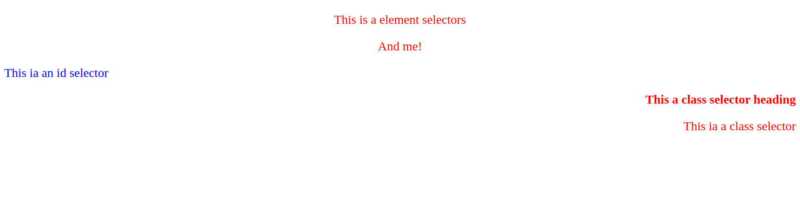

# How to select elements ?

- Elements can be selected using different type of selectors.

  - tag
  - id
  - class
  - universal

**Code**

```html
<!DOCTYPE html>
<html lang="en">
  <head>
    <meta charset="UTF-8" />
    <meta name="viewport" content="width=device-width, initial-scale=1.0" />
    <title>Selecting elements</title>
    <style>
      p {
        text-align: center;
        color: red;
      }
      #para1 {
        text-align: left;
        color: blue;
      }
      .right {
        text-align: right;
        color: red;
      }
      * {
        font-size: 24px;
        color: aqua;
      }
    </style>
  </head>
  <body>
    <p>This is a element selectors</p>
    <p>And me!</p>
    <p id="para1">This ia an id selector</p>
    <h1 class="right">This a class selector heading</h1>
    <p class="right">This ia a class selector</p>
  </body>
</html>
```

**Output**


