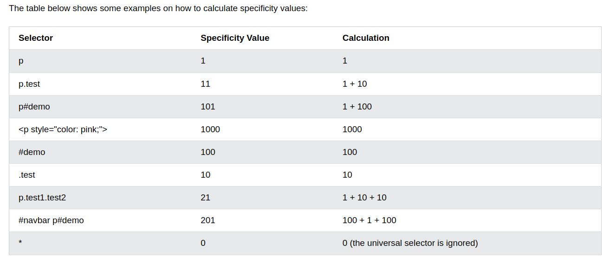

# Specificity of selecting elements

- Specificity is a score that determines which style declaration is ultimately applied to an element.

- Selector with highest score wins.

- Specificity Calculation



**Code**

- Check which rule will be applied.

```html
<!DOCTYPE html>
<html lang="en">
  <head>
    <meta charset="UTF-8" />
    <meta name="viewport" content="width=device-width, initial-scale=1.0" />
    <title>Specificity</title>
    <style>
      p#demo {
        color: yellow;
      }
      #demo {
        color: blue;
      }
      .test {
        color: green;
      }
      p {
        color: red;
      }
    </style>
  </head>
  <body>
    <p id="demo" class="test">Hello world!</p>
  </body>
</html>
```

- Exception: if you use the !important rule, it will override ALL previous styling rules for that specific property on that element.
