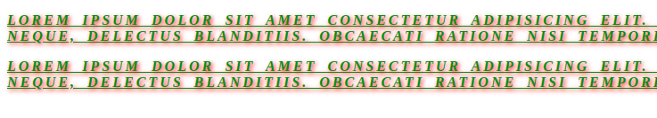

# Styling a text element

**Code**

```html
<!DOCTYPE html>
<html lang="en">
  <head>
    <meta charset="UTF-8" />
    <meta name="viewport" content="width=device-width, initial-scale=1.0" />
    <title>Styling a text</title>
    <style>
      p {
        color: green;
        text-align: justify;
        text-decoration: underline;
        font-weight: bold;
        font-style: italic;
        letter-spacing: 3px;
        word-spacing: 5px;
        text-shadow: 2px 2px 5px red;
        text-transform: uppercase;
      }
    </style>
  </head>
  <body>
    <p>
      Lorem ipsum dolor sit amet consectetur adipisicing elit. Expedita
      perspiciatis, dolore aut architecto nam, placeat ratione consectetur
      tenetur neque, delectus blanditiis. Obcaecati ratione nisi temporibus
      voluptatum repellendus magni corrupti! Eius!
    </p>
  </body>
</html>
```

**code**

