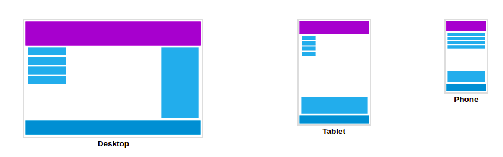
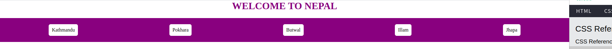
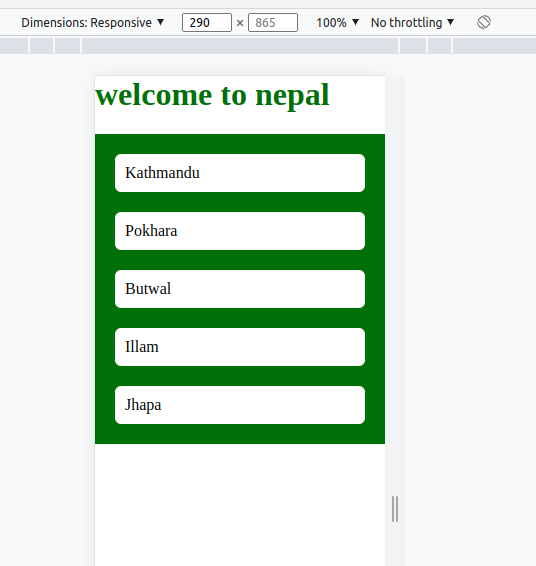

# Responsive web pages using media queries

- Responsive web design makes your web page look good on all devices.
- Responsive web design uses only HTML and CSS.



**code**

```html
<html>
  <head>
    <meta name="viewport" content="width=device-width, initial-scale=1.0" />
    <style>
      h1 {
        color: purple;
        text-align: center;
        text-transform: uppercase;
      }
      #cities {
        background-color: purple;
        padding: 10px;
        display: flex;
        flex-wrap: wrap;
        justify-content: space-around;
        /* position: sticky;
        top: 0; */
      }
      .city {
        background-color: white;
        color: black;
        margin: 10px;
        padding: 10px;
        border-radius: 6px;
      }

      .city:hover {
        color: white;
        background-color: black;
        cursor: pointer;
      }

      body {
        margin: 0;
      }

      img {
        height: 30px;
        position: fixed;
        bottom: 0;
        right: 0;
        margin: 5px;
      }

      @media only screen and (max-width: 768px) {
        h1 {
          color: darkgreen;
          text-align: left;
          text-transform: lowercase;
        }

        #cities {
          flex-direction: column;
          background-color: darkgreen;
          position: sticky;
          top: 0;
        }
        .city {
          background-color: white;
        }

        img {
          height: 30px;
          position: fixed;
          bottom: 0;
          right: 0;
          margin: 5px;
        }
      }
    </style>
  </head>
  <body>
    <h1>Welcome to Nepal</h1>
    <div id="cities">
      <div class="city">Kathmandu</div>
      <div class="city">Pokhara</div>
      <div class="city">Butwal</div>
      <div class="city">Illam</div>
      <div class="city">Jhapa</div>
    </div>
    <div>
      Onboard on your journey to get real-life skills. SkillPrompt helps you to
      gain industry specific skills and knowledge with the help of experts
      working in the field. With our Job Ready Program, you will build a career
      and succeed with a guarantee. Onboard on your journey to get real-life
      skills. SkillPrompt helps you to gain industry specific skills and
      knowledge with the help of experts working in the field. With our Job
      Ready Program, you will build a career and succeed with a guarantee.
      Onboard on your journey to get real-life skills. SkillPrompt helps you to
      gain industry specific skills and knowledge with the help of experts
      working in the field. With our Job Ready Program, you will build a career
      and succeed with a guarantee. Onboard on your journey to get real-life
      skills. SkillPrompt helps you to gain industry specific skills and
      knowledge with the help of experts working in the field. With our Job
      Ready Program, you will build a career and succeed with a guarantee.
      Onboard on your journey to get real-life skills. SkillPrompt helps you to
      gain industry specific skills and knowledge with the help of experts
      working in the field. With our Job Ready Program, you will build a career
      and succeed with a guarantee. Onboard on your journey to get real-life
      skills. SkillPrompt helps you to gain industry specific skills and
      knowledge with the help of experts working in the field. With our Job
      Ready Program, you will build a career and succeed with a guarantee.
      Onboard on your journey to get real-life skills. SkillPrompt helps you to
      gain industry specific skills and knowledge with the help of experts
      working in the field. With our Job Ready Program, you will build a career
      and succeed with a guarantee. Onboard on your journey to get real-life
      skills. SkillPrompt helps you to gain industry specific skills and
      knowledge with the help of experts working in the field. With our Job
      Ready Program, you will build a career and succeed with a guarantee.
    </div>
    
  </body>
</html>
```

**output**

- laptop view



- mobile view


