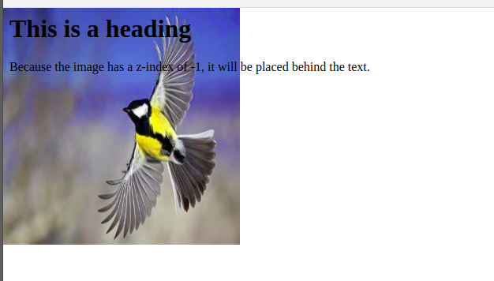

# z-index

- When elements are positioned, they can overlap other elements.
- The z-index property specifies the stack order of an element (which element should be placed in front of, or behind, the others).

**code**

```html
<html>
  <head>
    <style>
      img {
        position: absolute;
        left: 0px;
        top: 0px;
        z-index: -1;
      }
    </style>
  </head>
  <body>
    <h1>This is a heading</h1>
    
    <p>
      Because the image has a z-index of -1, it will be placed behind the text.
    </p>
  </body>
</html>
```

**output**


