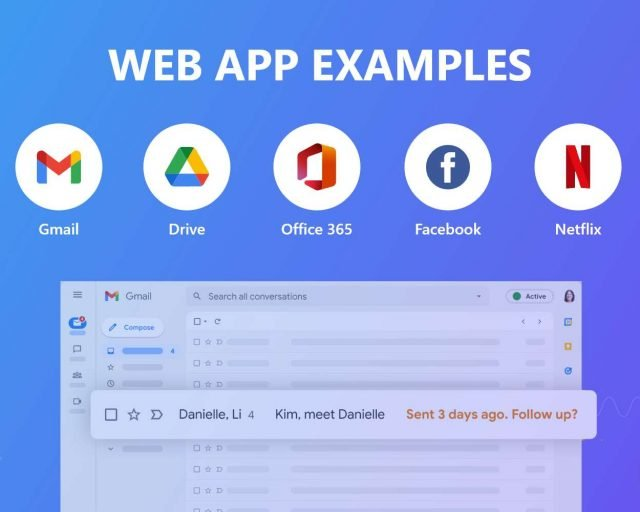
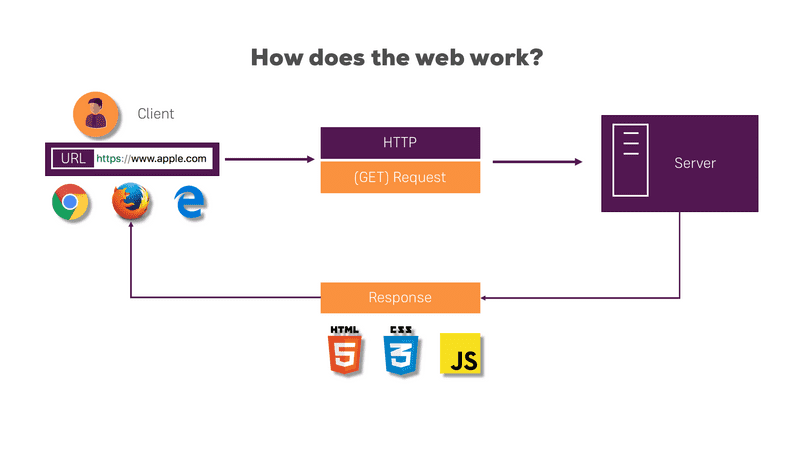

### 1. Introduction to web development

- It is the process of building and maintaining websites, web applications, etc

- Examples

  

- How does the web work ?

  

### 2. Web Browsers and search Engines

2.1 Browsers

- A software application helps to access, retrieve, and view information on the internet
- Interprets and displays web pages, which are written in languages like HTML and CSS, and allows users to interact with web content.
- Examples: Google chrome, firefox, microsoft edge, safari, etc.

  2.2 Search Engines

- A web-based tool that helps users find information on the internet by indexing web pages and using algorithms to deliver relevant search results based on user queries.
- Examples: Google Search, Yahoo Search, Bing, DuckDuckGo, Baidu etc
