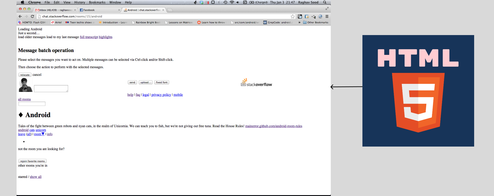

### 1. Introduction to HTML




- **HTML**: Hypertext Markup Language

<hr/>

### 2. Basic Structure of HTML Document

```html
<!DOCTYPE html>
<html>
  <head>
    <title>Page Title</title>
  </head>
  <body>
    <h1>My First Heading</h1>
    <p>My first paragraph.</p>
  </body>
</html>
```


<hr/>

### 3. Basic tag#1

- heading tags with align attribute (h1- h6)
- paragraph tag (p)
- divison tag (div)
- break line (br)
- horizontal line (hr)
- Formatting Text (b, i, u, mark, sup, sub, em, blockquote, preformatted)
- address tag (address)
- marquee tag (marquee)
- comments

```html
<!DOCTYPE html>
<head>
    <title>first page</title>
</head>
<body>
    <h1>Hi i am h1 tag</h1>
    <h2 align="center">Hi i am h2 tag</h2>
    <h6>Hi i am h6 tag</h6>
    <p>Lorem ipsum dolor sit amet consectetur adipisicing elit. Amet sapiente dolorem eius, blanditiis voluptate optio dolore iure fugiat officiis aperiam.</p>
    <hr/>
    <div>Lorem ipsum dolor sit amet consectetur adipisicing elit.<br/> Id, accusantium rerum unde incidunt corrupti eius voluptate sint optio doloremque saepe aut minus iste deserunt quod officiis voluptatem ducimus magni. Tempore.</div>
    <div>
        <h1>My nam is <b>xyz</b> and my address is <i>butwal</u></i></h1>
    </div>
    <div>
        <mark>Highlighted text</mark>
        a<sup>2</sup>b<sup>2</sup>
        H<sub>2</sub>O
        This is <em>emphasized</em> text.
        <blockquote>
            This is a blockquote. It is used to highlight a large section of quoted text.
        </blockquote>
        <pre>
            This is preformatted text.
            It preserves whitespace and line breaks.
        </pre>
    </div>
    <address>
        Contact us at: <a href="mailto:support@example.com">support@example.com</a><br>
        1234 Main St, Anytown, USA
    </address>
    <marquee direction="left">Scrolling Text</marquee>

</body>
</html>
```
