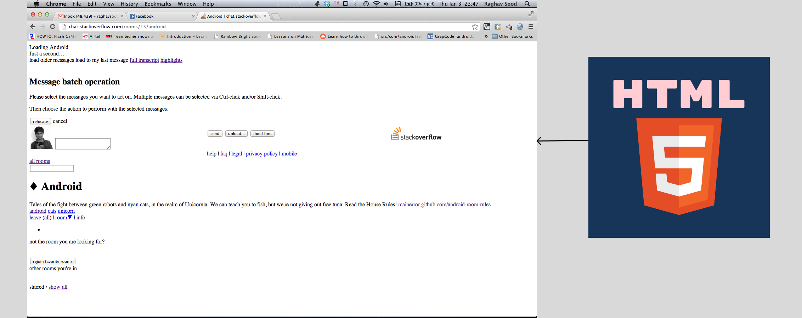

# Introduction to HTML



- **HTML**: Hypertext Markup Language
- **Hypertext**: Text linked to another text
- **Markup** Language: Computer language that turn text into image, table, layouts etc

## Basic Structure of HTML Document

```html
<!DOCTYPE html>
<html>
  <head>
    <title>Page Title</title>
  </head>
  <body>
    <h1>My First Heading</h1>
    <p>My first paragraph.</p>
  </body>
</html>
```


