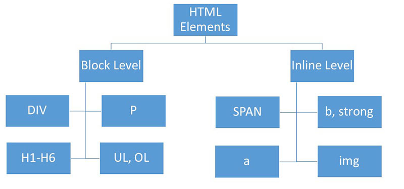

### 1. HTML Elements and Tags

**1.1 HTML Elements**

- Some examples of HTML element
  - html
  - head
  - body
  - heading
  - paragraph
  - link (a)

**1.2 HTML Tags**

- \<html\>, \<head\>, \</head\>, etc are examples of HTML tags.

### Difference between HTML elements and tags


<hr/>

### 2. Block and inline elements


**Examples**



**Code**

```html
<!DOCTYPE html>
<html lang="en">
  <head>
    <title>Block and inline elements</title>
  </head>
  <body>
    <div>I am div one.</div>
    <h1>Heading one</h1>
    <p>I am a paragraph one.</p>
    <span>I am span one.</span>
    <span>I am span two.</span>
    <b>hello world</b>
  </body>
</html>
```
