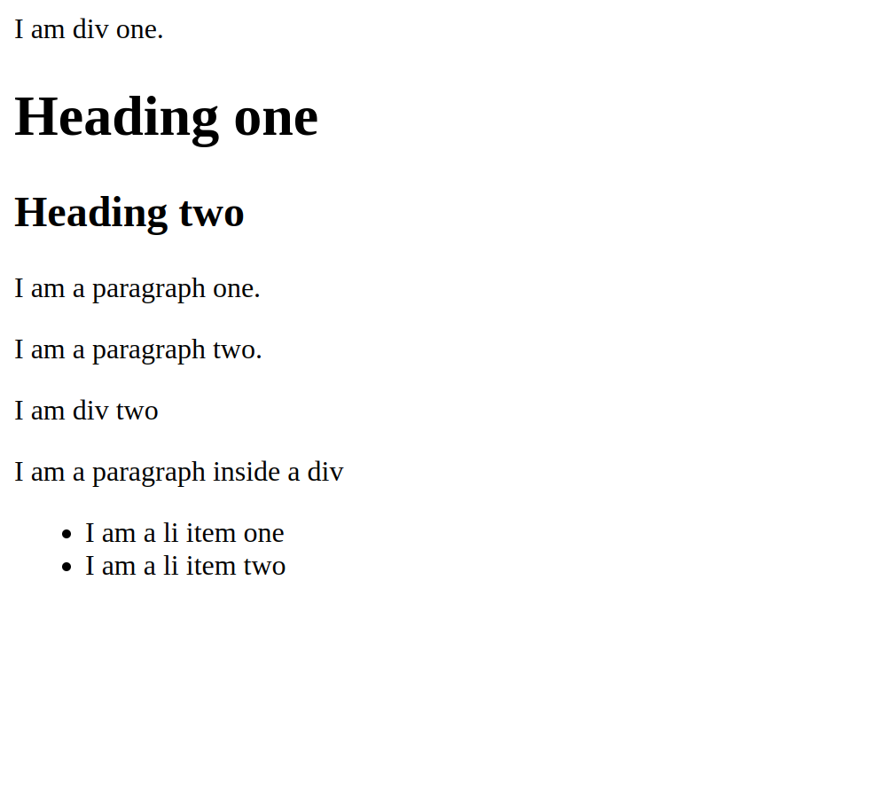

# Block and inline elements

## Difference between block and inline elements


## Examples


### Block element

**Code**

```html
<!DOCTYPE html>
<html lang="en">
  <head>
    <meta charset="UTF-8" />
    <meta name="viewport" content="width=device-width, initial-scale=1.0" />
    <title>Block and inline elements</title>
  </head>
  <body>
    <div>I am div one.</div>
    <h1>Heading one</h1>
    <h2>Heading two</h2>
    <p>I am a paragraph one.</p>
    <p>I am a paragraph two.</p>
    <div>I am div two</div>

    <div>
      <p>I am a paragraph inside a div</p>
      <ul>
        <li>I am a li item one</li>
        <li>I am a li item two</li>
      </ul>
    </div>
  </body>
</html>
```

**Output**



### Inline element

**Code**

```html
<!DOCTYPE html>
<html lang="en">
  <head>
    <meta charset="UTF-8" />
    <meta name="viewport" content="width=device-width, initial-scale=1.0" />
    <title>Block and inline elements</title>
  </head>
  <body>
    <span>I am span one.</span>
    <span>I am span two.</span>
    <a href="https://skillprompt.com"
      >I am link to <strong>skillprompt.com</strong></a
    >
    
  </body>
</html>
```

**Output**


