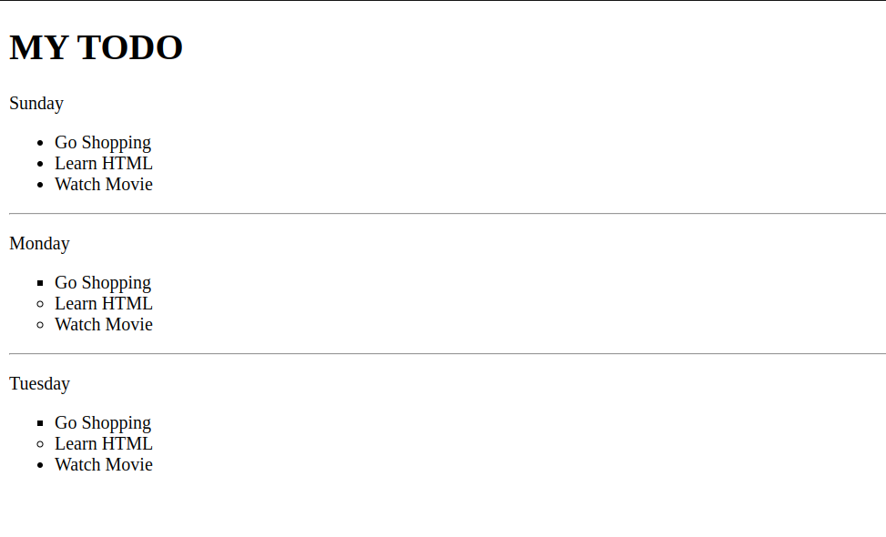
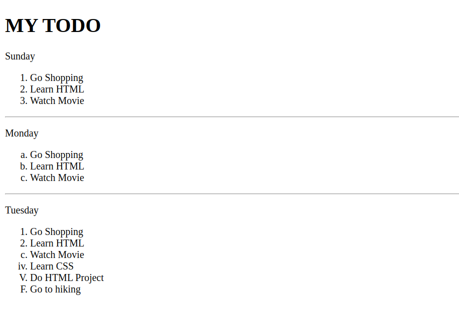

# Lists

## Unordered lists

**Code**

```html
<!DOCTYPE html>
<html lang="en">
  <head>
    <meta charset="UTF-8" />
    <meta name="viewport" content="width=device-width, initial-scale=1.0" />
    <title>Lists</title>
  </head>
  <body>
    <div>
      <h1>MY TODO</h1>
      <div>
        <p>Sunday</p>
        <!-- disc is default -->
        <ul type="disc">
          <li>Go Shopping</li>
          <li>Learn HTML</li>
          <li>Watch Movie</li>
        </ul>
        <hr />
        <p>Monday</p>
        <ul type="circle">
          <li type="square">Go Shopping</li>
          <li>Learn HTML</li>
          <li>Watch Movie</li>
        </ul>
        <hr />
        <p>Tuesday</p>
        <ul type="square">
          <li>Go Shopping</li>
          <li type="circle">Learn HTML</li>
          <li type="disc">Watch Movie</li>
        </ul>
      </div>
    </div>
  </body>
</html>
```

**Output**



## Ordered lists

**Code**

```html
<!DOCTYPE html>
<html lang="en">
  <head>
    <meta charset="UTF-8" />
    <meta name="viewport" content="width=device-width, initial-scale=1.0" />
    <title>Lists</title>
  </head>
  <body>
    <div>
      <h1>MY TODO</h1>
      <div>
        <p>Sunday</p>
        <!-- number is default -->
        <ol>
          <li>Go Shopping</li>
          <li>Learn HTML</li>
          <li>Watch Movie</li>
        </ol>
        <hr />
        <p>Monday</p>
        <ol type="a">
          <li>Go Shopping</li>
          <li>Learn HTML</li>
          <li>Watch Movie</li>
        </ol>
        <hr />
        <p>Tuesday</p>
        <ol type="square">
          <li>Go Shopping</li>
          <li type="1">Learn HTML</li>
          <li type="a">Watch Movie</li>
          <li type="i">Learn CSS</li>
          <li type="I">Do HTML Project</li>
          <li type="A">Go to hiking</li>
        </ol>
      </div>
    </div>
  </body>
</html>
```

**Output**


