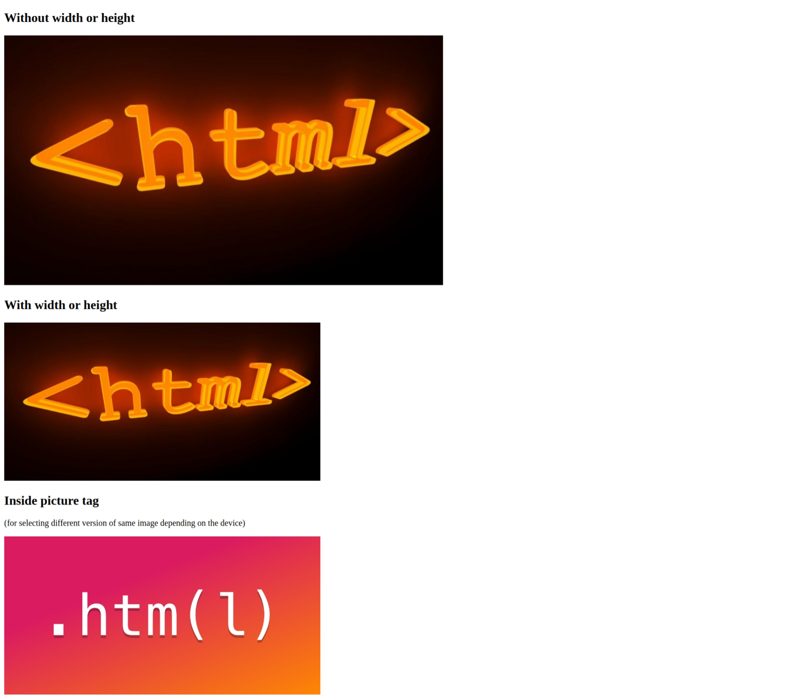

# Images

**Code**

```html
<!DOCTYPE html>
<html lang="en">
  <head>
    <meta charset="UTF-8" />
    <meta name="viewport" content="width=device-width, initial-scale=1.0" />
    <title>Images</title>
  </head>
  <body>
    <div>
      <h2>Without width or height</h2>
      
    </div>
    <div>
      <h2>With width or height</h2>
      
    </div>

    <div>
      <span>
        <h2>Inside picture tag</h2>
        <p>
          (for selecting different version of same image depending on the
          device)
        </p>
      </span>
      <picture>
        <source
          srcset="
            https://f.hubspotusercontent10.net/hubfs/3024469/logo-2582748_1280.png
          "
          media="(max-width: 600px)"
        />
        
      </picture>
    </div>
  </body>
</html>
```

**Output**



## Other media tags

- Audio
- Video
