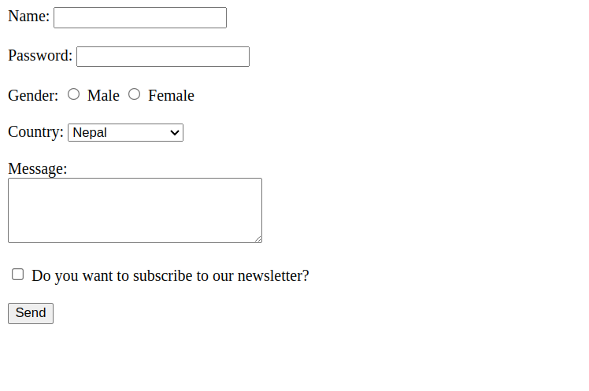

# Forms

## Different type of form elements

**Code**

```html
<!DOCTYPE html>
<html lang="en">
  <head>
    <meta charset="UTF-8" />
    <meta name="viewport" content="width=device-width, initial-scale=1.0" />
    <title>Forms</title>
  </head>
  <body>
    <form>
      <div>
        <label for="name">Name:</label>
        <input type="text" name="name" /><br /><br />
      </div>
      <div>
        <label for="password">Password:</label>
        <input type="password" name="password" /><br /><br />
      </div>
      <div>
        <label for="gender">Gender:</label>
        <input type="radio" name="gender" id="male" value="male" />
        <label for="male">Male</label>
        <input type="radio" name="gender" id="female" value="female" />
        <label for="female">Female</label> <br /><br />
      </div>
      <div>
        <label for="country">Country: </label>
        <select name="country" id="country">
          <option>Select an option</option>
          <option value="nepal" selected>Nepal</option>
          <option value="usa">USA</option>
          <option value="australia">Australia</option></select
        ><br /><br />
      </div>
      <div>
        <label for="message">Message:</label><br />
        <textarea name="message" id="message" cols="30" rows="4"></textarea
        ><br /><br />
      </div>
      <div>
        <input type="checkbox" name="newsletter" id="newsletter" />
        <label for="newsletter"
          >Do you want to subscribe to our newsletter?</label
        ><br /><br />
      </div>
      <input type="submit" value="Send" />
    </form>
  </body>
</html>
```

**Output**



## Form Attributes

- name

  - Specify the name of the form in order to access the form using Javascript

  **Code**

  ```html
  <form name="newsletter-form">
    <!-- elements -->
    <!-- ......... -->
  </form>
  ```

- action

  - Url of the server where form is to be submitted

  **Code**

  ```html
  <form action="/newsletter-register">
    <!-- elements -->
    <!-- ......... -->
  </form>
  ```

- method

  - **post**: to update a resource on a server
  - **get**: to fetch data of a resource from a server

  **Code**

  ```html
  <form action="/newsletter-register" method="post">
    <!-- elements -->
    <!-- ......... -->
  </form>
  ```
