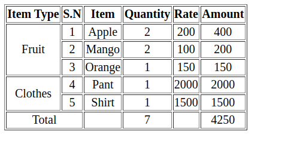

# Tables

## Table tags

- \<table>: define the table
- \<tr>: define a row
- \<th>: define a table header
- \<td>: define a table cells data
- \<thead>: define a header section
- \<tbody>: define a body section
- \<tfoot>: define a footer section

**Code**

```html
<!DOCTYPE html>
<html lang="en">
  <head>
    <meta charset="UTF-8" />
    <meta name="viewport" content="width=device-width, initial-scale=1.0" />
    <title>Tables</title>
  </head>
  <body>
    <table border="1">
      <thead align="center">
        <tr>
          <th>S.N</th>
          <th>Item</th>
          <th>Quantity</th>
          <th>Rate</th>
          <th>Amount</th>
        </tr>
      </thead>
      <tbody align="center">
        <tr>
          <td>1</td>
          <td>Apple</td>
          <td>2</td>
          <td>200</td>
          <td>400</td>
        </tr>
        <tr>
          <td>2</td>
          <td>Mango</td>
          <td>2</td>
          <td>100</td>
          <td>200</td>
        </tr>
        <tr>
          <td>3</td>
          <td>Orange</td>
          <td>1</td>
          <td>150</td>
          <td>150</td>
        </tr>
      </tbody>
      <tfoot align="center">
        <tr>
          <td></td>
          <td>Total</td>
          <td>5</td>
          <td></td>
          <td>750</td>
        </tr>
      </tfoot>
    </table>
  </body>
</html>
```

## Table attributes

- border: show border for the table

- colspan: number of columns a cell can occupy

**Code**

```html
<tfoot align="center">
  <tr>
    <td colspan="2">Total</td>
    <td>5</td>
    <td></td>
    <td>750</td>
  </tr>
</tfoot>
```

- rowspan: number of rows a cell can occupy

**Code**

```html
<!DOCTYPE html>
<html lang="en">
  <head>
    <meta charset="UTF-8" />
    <meta name="viewport" content="width=device-width, initial-scale=1.0" />
    <title>Tables</title>
  </head>
  <body>
    <table border="1">
      <thead align="center">
        <tr>
          <th rowspan="3">Item Type</th>
          <th>S.N</th>
          <th>Item</th>
          <th>Quantity</th>
          <th>Rate</th>
          <th>Amount</th>
        </tr>
      </thead>
      <tbody align="center">
        <tr>
          <td rowspan="3">Fruit</td>
          <td>1</td>
          <td>Apple</td>
          <td>2</td>
          <td>200</td>
          <td>400</td>
        </tr>
        <tr>
          <td>2</td>
          <td>Mango</td>
          <td>2</td>
          <td>100</td>
          <td>200</td>
        </tr>
        <tr>
          <td>3</td>
          <td>Orange</td>
          <td>1</td>
          <td>150</td>
          <td>150</td>
        </tr>

        <tr>
          <td rowspan="2">Clothes</td>
          <td>4</td>
          <td>Pant</td>
          <td>1</td>
          <td>2000</td>
          <td>2000</td>
        </tr>
        <tr>
          <td>5</td>
          <td>Shirt</td>
          <td>1</td>
          <td>1500</td>
          <td>1500</td>
        </tr>
      </tbody>
      <tfoot align="center">
        <tr>
          <td colspan="2">Total</td>
          <td></td>
          <td>7</td>
          <td></td>
          <td>4250</td>
        </tr>
      </tfoot>
    </table>
  </body>
</html>
```

**Output**


