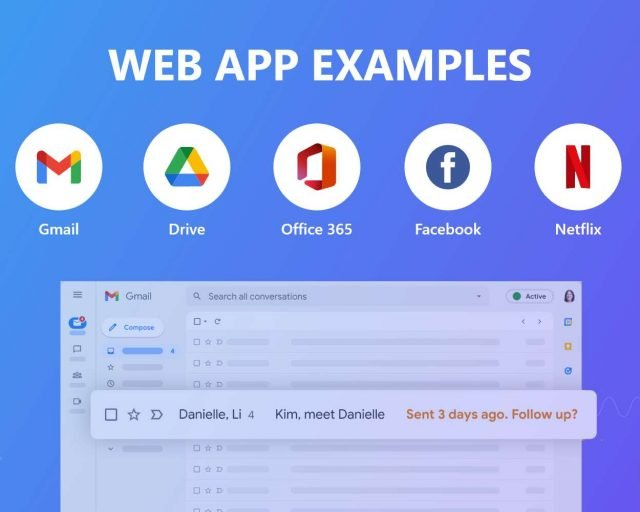

### 1. Introduction to web development

- It is the process of building and maintaining websites, web applications, etc

- Examples

  

- How does the web work ?

  

### 2. Web Browsers and search Engines

**2.1 Browsers**

- A software application helps to access, retrieve, and view information on the internet
- Interprets and displays web pages, which are written in languages like HTML and CSS, and allows users to interact with web content.
- **Examples: Google chrome, firefox, microsoft edge, safari, etc.**

**2.2 Search Engines**

- A web-based tool that helps users find information on the internet by indexing and retrieving web pages based on keywords or queries entered by the user.
- **Examples: Google Search, Yahoo Search, Bing, DuckDuckGo, Baidu etc**

### 3. Overview of various internet & web technologies

- **Internet**: A global network that connects billions of computers across the world with each other and to the World Wide Web.
  

- **World Wide Web (WWW)**:
  World Wide Web, which is also known as a Web, is a collection of websites or web
  pages stored in web servers and connected to local computers through the internet.

**Covers various aspects:**

1. **Internet Protocols**:
   Helps to transfer & communicates with internet. Eg: HTTP, HTTPS, SMTP, FTP, etc

2. **Networking**: Wi-Fi provides wireless internet access (e.g., connecting to home networks).

3. **Web Technologies**:
   

4. **Web Hosting**: GoDaddy and AWS provide server space to host websites (e.g., company websites, e-commerce sites).

5. **Email**: SMTP is used for sending emails (e.g., Gmail).

6. **Communication**: VoIP like Skype enables voice/video calls over the internet. WhatsApp facilitates instant messaging.

7. **Search Engines**: Google and Bing help find information online (e.g., searching for recipes).

8. **Security**: Antivirus software protect networks and devices from threats (e.g., Antivirus).
